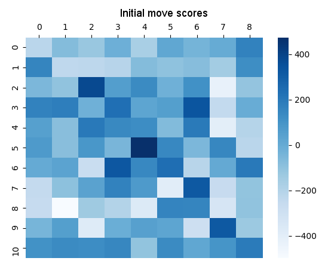
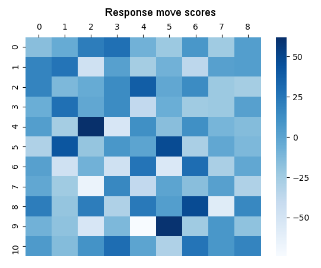

# Build an Adversarial Game Playing Agent
### Franz Williams

## Introduction
In this project, I implemented a minimax agent with alpha-beta pruning and iterative deepening.
For my search technique, I chose to build an opening book with a depth of 4.

## Report Questions
#### Describe your process for collecting statistics to build your opening book. How did you choose states to sample? And how did you perform rollouts to determine a winner?
For every combination of the first 4 plies, I simulated 10 rollouts from that point onward where both players randomly chose an action from the ones available.
The most beneficial move for each state was determined using a score of `wins - losses`.

#### What opening moves does your book suggest are most effective on an empty board for player 1 and what is player 2's best reply?
The best opening move discovered was at the center of the board (5, 4), with the best response being at (4, 2).
Below are heatmaps for the initial state and responses to (5, 4) respectively; darkness represents the total `wins - losses` score if the move at (y, x) were to be played.

{ width=300px }
{ width=300px }

## Results
As a baseline, I configured the agent to choose a random move for the first 4 plies.
I also added an agent that *only* used the minimax implementation (no random moves, and no opening book) to confirm that the opening book is more beneficial than just using minimax outright.

| Algorithm | Wins | Losses | Win % |
| --- | --- | --- | --- |
| Choose random move | 384 | 116 | 76.8% |
| Follow minimax implementation | 402 | 98 | 80.4% |
| Use opening book | 431 | 69 | 86.2% |

In the above table, the "Algorithm" column describes the behavior of the agent for the first 4 plies.
After the first 4 plies, the agent will just follow the minimax implementation.

As expected, by using the opening book, the agent wins more games than with random move selection.
In addition, the opening book agent also outperformed the minimax-only agent.
